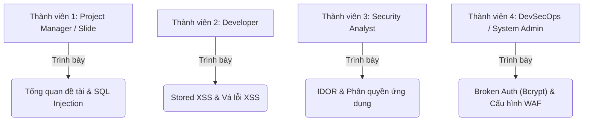

# ĐÁNH GIÁ DỰ ÁN DƯỚI GÓC NHÌN GIẢNG VIÊN (9.5 - 10/10)
## Đánh giá tổng quan, Câu hỏi phản biện & Kịch bản phân chia thuyết trình cho nhóm 4 người

Dưới đây là nhận xét, đánh giá khách quan của tôi nếu tôi là giảng viên chấm điểm môn **Bảo mật Ứng dụng & Hệ thống** cho nhóm của bạn.

---

## 1. Điểm số dự kiến: 9.0 - 9.5 / 10
Dự án của bạn đã làm **vượt mức kỳ vọng** của một bài tập lớn thông thường. Các điểm sáng giúp bạn dễ dàng đạt điểm giỏi gồm:
*   **Thực tiễn (Hands-on):** Có ứng dụng chạy thật, có cả 2 phiên bản lỗi/vá song song trực quan. Giảng viên cực kỳ ghét các nhóm chỉ trình bày slide lý thuyết suông.
*   **Docker hóa (System Security):** Đóng gói bằng Docker Compose. Điều này giúp giảng viên kiểm thử bài làm của bạn chỉ với 1 lệnh, không bị lỗi tương thích môi trường.
*   **Lớp phòng thủ WAF:** Có ModSecurity WAF tích hợp. Đây là điểm cộng rất lớn vì môn học là "Bảo mật ứng dụng **và Hệ thống**". WAF chính là phần an toàn hệ thống (Network/Web Server layer).

---

## 2. Những điểm cần bổ sung để chắc chắn đạt 10/10
Với nhóm **4 người**, giảng viên có thể đánh giá quy mô dự án hơi nhỏ nếu chỉ dừng lại ở 4 lỗ hổng cơ bản. Để lấy điểm 10 tuyệt đối và phòng thủ trước các câu hỏi phản biện khó, nhóm nên chuẩn bị các nội dung sau:

### ⚠️ Các câu hỏi phản biện giảng viên chắc chắn sẽ hỏi:
1.  **"Tại sao WAF ModSecurity lại không chặn được lỗ hổng IDOR khi ta đổi `?id=1` thành `?id=2`?"**
    *   *Trả lời:* Vì IDOR là lỗ hổng thuộc về **Business Logic (Logic nghiệp vụ)** của ứng dụng. Về mặt cú pháp, request `?id=2` hoàn toàn hợp lệ, không chứa ký tự độc hại (như script hay SQL keywords) nên WAF không thể nhận biết được. Đây là minh chứng cho thấy WAF không thể thay thế cho việc viết code an toàn ở phía Backend.
2.  **"Thuật toán Bcrypt các em dùng có ưu điểm gì so với MD5 hay SHA-256?"**
    *   *Trả lời:* Bcrypt có cơ chế **Salt (muối)** tự động tích hợp bên trong chuỗi hash giúp chống tấn công Rainbow Table (bảng băm chuẩn bị sẵn). Ngoài ra, Bcrypt là một thuật toán **chậm có chủ đích (Slow by design)**. Ta có thể tăng tham số *work factor* (độ phức tạp) để làm chậm quá trình băm, khiến việc tấn công Brute-force/Dictionary attack tốn hàng nghìn năm, trong khi MD5 và SHA-256 chạy quá nhanh, dễ bị bẻ khóa bằng GPU công suất lớn.
3.  **"Làm thế nào để bypass WAF của các em?"**
    *   *Chuẩn bị:* Giảng viên rất thích hỏi câu này để xem các em có hiểu sâu về WAF không. Hãy trả lời rằng WAF hoạt động dựa trên các bộ luật (Signature-based). Nếu ta sử dụng các kỹ thuật che giấu (Obfuscation), Encoding (ví dụ Double URL Encoding) hoặc các payload XSS mới chưa có trong bộ luật CRS thì vẫn có khả năng bypass được. Vì vậy, bảo mật ứng dụng gốc (code vá) vẫn là quan trọng nhất.

---

## 3. Kịch bản phân chia vai trò thuyết trình (Nhóm 4 người)
Giảng viên sẽ trừ điểm nặng nếu thấy chỉ có 1-2 bạn làm và thuyết trình, còn các thành viên khác đứng im. Hãy phân chia vai trò chuyên nghiệp như sau:

### Chi tiết phân công khi đứng trước hội đồng:

#### 🗣️ Thành viên 1 (Trưởng nhóm - Thuyết trình lý thuyết & SQLi):
*   **Nhiệm vụ:**
    *   Giới thiệu đề tài, lý do lựa chọn lab (trực quan, dễ tiếp cận).
    *   Giới thiệu kiến trúc tổng quan hệ thống (2 cổng: 8081 trực tiếp và 80 qua WAF).
    *   Trình bày lỗ hổng **SQL Injection** ở màn đăng nhập: chỉ ra dòng code lỗi, thực hiện demo bypass login bằng `' OR '1'='1' --` và giải thích cơ chế câu SQL bị thay đổi logic. Trình bày cách vá bằng Prepared Statement.

#### 🗣️ Thành viên 2 (Demo Tấn công & Vá lỗ hổng Stored XSS):
*   **Nhiệm vụ:**
    *   Trình bày lỗ hổng **Stored XSS** ở phần Bình luận.
    *   Demo gửi payload `` và giải thích tác hại của việc hacker chiếm đoạt Session Cookie để giả mạo người dùng.
    *   Giải thích cơ chế vá lỗi bằng cách dùng hàm `htmlspecialchars()` để escape toàn bộ các thẻ HTML nguy hiểm trước khi render ra màn hình.

#### 🗣️ Thành viên 3 (Trình bày lỗ hổng logic - IDOR):
*   **Nhiệm vụ:**
    *   Đảm nhận phần **IDOR (Insecure Direct Object Reference)**.
    *   Đăng nhập tài khoản thường (Bob) $\rightarrow$ Đổi tham số `?id=2` trên URL $\rightarrow$ Đọc trộm thông tin lương của Alice $\rightarrow$ Giải thích đây là lỗi kiểm soát truy cập (Broken Access Control).
    *   Trình bày cách sửa: Server bắt buộc phải đối chiếu xem `$requested_id` có trùng với `$session_user_id` đang đăng nhập hay không, hoặc user đó có quyền `admin` hay không trước khi truy vấn DB.

#### 🗣️ Thành viên 4 (Trình bày Mật mã & Lớp WAF hệ thống):
*   **Nhiệm vụ:**
    *   Trình bày lỗi **Broken Authentication** (Plaintext Password) ở trang Dump DB $\rightarrow$ Giải thích tại sao lưu mật khẩu thô nguy hiểm $\rightarrow$ Trình bày giải pháp băm mật khẩu bằng **Bcrypt** kèm hàm `password_hash()` và `password_verify()`.
    *   Trình bày phần **ModSecurity WAF** chạy trên Docker: Demo truy cập qua cổng 80, thực hiện lại các payload SQLi/XSS cũ và chỉ ra màn hình **403 Forbidden** do WAF chặn. Giải thích vai trò của WAF như một lớp lá chắn vòng ngoài.
