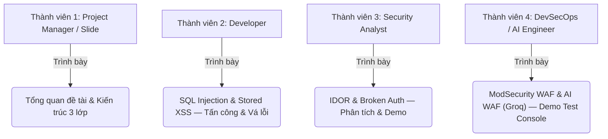

# ĐÁNH GIÁ DỰ ÁN DƯỚI GÓC NHÌN GIẢNG VIÊN (9.5 - 10/10)
## Đánh giá tổng quan, Câu hỏi phản biện & Kịch bản phân chia thuyết trình cho nhóm 4 người

Dưới đây là nhận xét, đánh giá khách quan của tôi nếu tôi là giảng viên chấm điểm môn **Bảo mật Ứng dụng & Hệ thống** cho nhóm của bạn.

---

## 1. Điểm số dự kiến: 9.5 - 10 / 10
Dự án của bạn đã làm **vượt mức kỳ vọng** của một bài tập lớn thông thường. Các điểm sáng giúp bạn dễ dàng đạt điểm tối đa gồm:
*   **Thực tiễn (Hands-on):** Có ứng dụng chạy thật, có cả 2 phiên bản lỗi/vá song song trực quan. Giảng viên cực kỳ ghét các nhóm chỉ trình bày slide lý thuyết suông.
*   **Docker hóa (System Security):** Đóng gói bằng Docker Compose. Điều này giúp giảng viên kiểm thử bài làm của bạn chỉ với 1 lệnh, không bị lỗi tương thích môi trường.
*   **Lớp phòng thủ đa tầng:** Có cả ModSecurity WAF (truyền thống) lẫn **AI WAF (Groq LLM)** tích hợp. Đây là điểm cực kỳ nổi bật so với các nhóm khác — thể hiện được tư duy hệ thống phòng thủ theo chiều sâu (Defense in Depth).
*   **AI WAF / Test Console:** Tích hợp LLM vào bảo mật là xu hướng công nghệ mới nhất. Bảng điều khiển một cửa giúp demo mượt mà, chuyên nghiệp.

---

## 2. Câu hỏi phản biện giảng viên chắc chắn sẽ hỏi

### ⚠️ Về WAF truyền thống (ModSecurity):
1.  **"Tại sao WAF ModSecurity lại không chặn được lỗ hổng IDOR khi ta đổi `?id=1` thành `?id=2`?"**
    *   *Trả lời:* Vì IDOR là lỗ hổng thuộc về **Business Logic (Logic nghiệp vụ)** của ứng dụng. Về mặt cú pháp, request `?id=2` hoàn toàn hợp lệ, không chứa ký tự độc hại (như script hay SQL keywords) nên WAF không thể nhận biết được. Đây là minh chứng cho thấy WAF không thể thay thế cho việc viết code an toàn ở phía Backend.
2.  **"Làm thế nào để bypass WAF ModSecurity của các em?"**
    *   *Chuẩn bị:* WAF hoạt động dựa trên các bộ luật (Signature-based). Nếu ta sử dụng các kỹ thuật che giấu (Obfuscation), Encoding (ví dụ Double URL Encoding) hoặc các payload XSS mới chưa có trong bộ luật CRS thì vẫn có khả năng bypass được. Đây chính là lý do dự án bổ sung thêm lớp AI WAF.

### ⚠️ Về AI WAF (Groq LLM):
3.  **"Tại sao dùng AI/LLM để làm WAF? Có ưu điểm gì hơn ModSecurity?"**
    *   *Trả lời:* AI WAF phân tích **ngữ cảnh** (context) của toàn bộ request thay vì chỉ khớp chuỗi (string matching). Nhờ đó nó có thể phát hiện các cuộc tấn công biến thể (obfuscated payloads) hoặc lỗ hổng business logic như IDOR mà ModSecurity bỏ sót. Model `llama-3.3-70b-versatile` của Groq đóng vai "chuyên gia bảo mật" để phán đoán.
4.  **"Hạn chế của AI WAF là gì?"**
    *   *Trả lời:* Có 3 nhược điểm chính: (1) **Độ trễ cao** (~300–800ms do gọi API Groq, so với ~1ms của ModSecurity); (2) **Phụ thuộc dịch vụ bên ngoài** — nếu Groq API ngừng hoạt động, lớp này mất tác dụng; (3) **Chi phí** — mỗi request tiêu thụ token API có thể phát sinh phí ở quy mô lớn. Giải pháp: kết hợp cả 3 lớp song song.
5.  **"Block threshold 70/100 của các em đặt theo tiêu chí nào?"**
    *   *Trả lời:* Đây là tham số cân bằng giữa **False Positive** (chặn nhầm request hợp lệ) và **False Negative** (bỏ sót tấn công). Ngưỡng 70 được chọn thực nghiệm để đảm bảo request thông thường không bị chặn (score thường < 30), trong khi các payload tấn công rõ ràng đạt score > 85.

### ⚠️ Về mật mã học:
6.  **"Thuật toán Bcrypt các em dùng có ưu điểm gì so với MD5 hay SHA-256?"**
    *   *Trả lời:* Bcrypt có cơ chế **Salt (muối)** tự động tích hợp bên trong chuỗi hash giúp chống tấn công Rainbow Table. Ngoài ra, Bcrypt là một thuật toán **chậm có chủ đích (Slow by design)**. Ta có thể tăng tham số *work factor* (độ phức tạp) để làm chậm quá trình băm, khiến việc tấn công Brute-force/Dictionary attack tốn hàng nghìn năm, trong khi MD5 và SHA-256 chạy quá nhanh, dễ bị bẻ khóa bằng GPU công suất lớn.

---

## 3. Kịch bản phân chia vai trò thuyết trình (Nhóm 4 người)
Giảng viên sẽ trừ điểm nặng nếu thấy chỉ có 1-2 bạn làm và thuyết trình, còn các thành viên khác đứng im. Hãy phân chia vai trò chuyên nghiệp như sau:

### Chi tiết phân công khi đứng trước hội đồng:

#### 🗣️ Thành viên 1 (Trưởng nhóm - Tổng quan & Kiến trúc):
*   **Nhiệm vụ:**
    *   Giới thiệu đề tài, lý do lựa chọn lab (trực quan, dễ tiếp cận, kết hợp AI).
    *   Giới thiệu kiến trúc tổng quan hệ thống **3 lớp phòng thủ**: cổng 8081 (trực tiếp), 8082 (ModSecurity), 8083 (AI WAF Groq).
    *   Giải thích tổng quan 4 lỗ hổng OWASP và tại sao chọn chúng.

#### 🗣️ Thành viên 2 (Demo Tấn công & Vá lỗ hổng SQLi & XSS):
*   **Nhiệm vụ:**
    *   Trình bày lỗ hổng **SQL Injection**: Demo bypass login bằng `' OR '1'='1' --`, chỉ ra dòng code lỗi, giải thích câu SQL bị thay đổi logic. Trình bày cách vá bằng Prepared Statement.
    *   Trình bày lỗ hổng **Stored XSS**: Demo gửi payload `` và giải thích tác hại. Giải thích cơ chế vá bằng `htmlspecialchars()`.

#### 🗣️ Thành viên 3 (Trình bày lỗ hổng logic - IDOR & Broken Auth):
*   **Nhiệm vụ:**
    *   Đảm nhận phần **IDOR (Insecure Direct Object Reference)**: Đăng nhập Bob → Đổi tham số `?id=2` → Đọc thông tin lương của Alice → Giải thích đây là lỗi kiểm soát truy cập. Trình bày cách vá: Server đối chiếu `$requested_id` với `$session_user_id`.
    *   Trình bày lỗi **Broken Authentication** (Plaintext Password): Xem trang Dump DB → Mật khẩu lộ rõ → Demo sau vá chỉ thấy chuỗi Bcrypt hash. Giải thích `password_hash()` và `password_verify()`.

#### 🗣️ Thành viên 4 (DevSecOps - WAF & AI WAF Demo):
*   **Nhiệm vụ:**
    *   Demo **ModSecurity WAF** qua cổng 8082: Thực hiện lại các payload SQLi/XSS cũ → Chỉ ra màn hình **403 Forbidden**. Giải thích vai trò WAF như lớp lá chắn vòng ngoài dựa trên OWASP CRS.
    *   Demo **AI WAF (Groq)** qua bảng điều khiển `http://localhost:8083/waf-test`: Nhấn từng nút ⚔️/🛡️/🤖 → Giải thích điểm Risk Score, cơ chế LLM phân tích ngữ cảnh, và ưu/nhược điểm so với ModSecurity.
    *   Nhấn mạnh điểm khác biệt: **AI WAF có thể chặn IDOR** (điều ModSecurity không làm được) nhờ hiểu ngữ cảnh.
